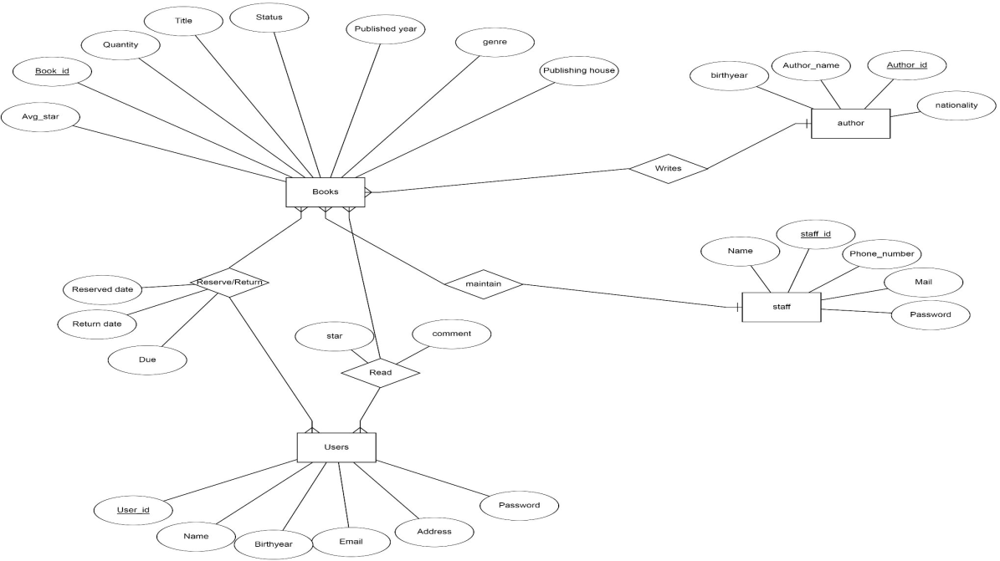
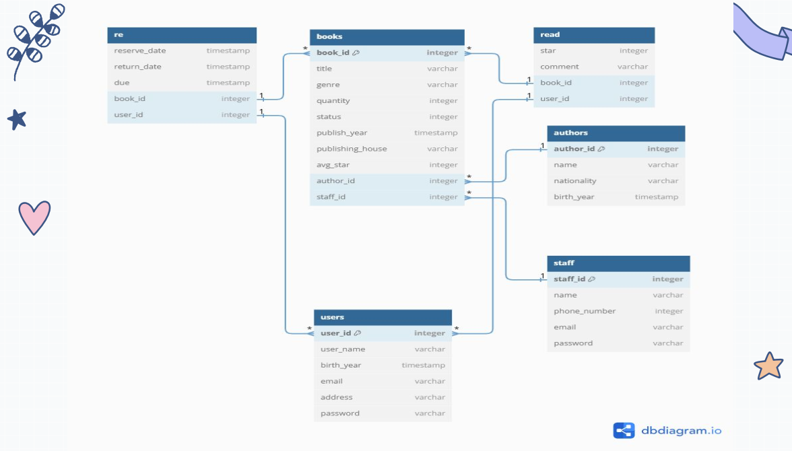

# Library Management System Database

A robust database design for a library management system, developed using PostgreSQL. This project focuses on a well-structured relational database with clearly defined business logic implemented through PostgreSQL functions.

---

## Table of Contents
- [Project Structure](#project-structure)
- [Overview](#overview)
- [Features](#features)
- [Entity-Relationship Diagram](#entity-relationship-diagram)
- [Database Structure](#database-structure)
- [Business Logic Functions](#business-logic-functions)
- [Getting Started](#getting-started)
- [Contributing](#contributing)
- [License](#license)

---

## Project Structure
- `sql_queries/`: Contains reusable SQL queries for data retrieval and reporting.
- `dataset_script/`: Includes scripts for initializing and populating the database.
- `functions_triggers/`: Encapsulates PostgreSQL functions and triggers for implementing business logic.
- `role/`: Defines role-based access control for administrators, librarians, and users.


## Overview
This project demonstrates a carefully designed database for a library management system. It is built to ensure data consistency, integrity, and scalability. The database handles core library operations such as:
- Tracking book inventories
- Managing library members
- Processing borrowing and return transactions
- Tracking fines and overdue records
- Creating monthly reports automatically

The strength of this project lies in its use of PostgreSQL functions to implement business logic directly within the database, minimizing the need for external application code.

---

## Features
- **Normalized Database Structure:** Ensures data integrity and prevents redundancy.
- **Entity-Relationship Diagram (ERD):** Visualizes the logical relationships between entities.
- **PostgreSQL Functions:** Encapsulates business logic for key operations, such as:
  - Borrowing and returning books
  - Calculating overdue fines
  - Generating reports (e.g., most borrowed books, active members)
- **Role-Based Access Control:** Grants specific permissions to administrators, librarians, and regular users.

---

## Entity-Relationship Diagram
Below is an overview of the database relationships represented in the ER diagram:

- **Entities:** Books, Members, Staff, Transactions, and Fines.
- **Relationships:**
  - Books are borrowed by Members through Transactions.
  - Fines are linked to overdue Transactions.



---

## Relationships-Table
The below relationships table shows all tables in our database:
 


---

## Database Structure
The database consists of the following tables:

- **Books:** Contains details such as title, author_id, genre, quantity and status.
- **Users:** Includes member information like name, contact details, and birthyear.
- **Staff:** Tracks staff information.
- **Read:** Keeps track of reading activities of users.
- **re:** Stands for reserve. Contains details like reserve_date, due_date.
- **authors:** Stores author's personal information.

---

## Business Logic Functions
Key PostgreSQL functions implemented in the database include:

1. **Borrow Book:**
   - Validates book availability and member eligibility.
   - Updates the transaction log and book status.

   ```sql
   CREATE OR REPLACE FUNCTION borrow_book(member_id INT, book_id INT) RETURNS VOID AS $$
   BEGIN
       -- Business logic here
   END;
   $$ LANGUAGE plpgsql;
   ```

2. **Return Book:**
   - Calculates overdue fines if applicable.
   - Updates the transaction log and book status.

3. **Generate Reports:**
   - Provides insights such as:
     - Most borrowed books
     - Active members

---

## Getting Started
### Prerequisites
- PostgreSQL installed on your system

### Steps
1. **Clone the Repository:**
   ```bash
   git clone https://github.com/nhatsonle/library-management.git
   ```

2. **Navigate to the Project Directory:**
   ```bash
   cd library-management-db
   ```

3. **Run the SQL Scripts:**
   - Create the database:
     ```bash
     psql -U <username> -f create_database.sql
     ```
   - Load the schema and functions:
     ```bash
     psql -U <username> -f schema.sql
     ```

4. **Test the Database:**
   Use sample SQL queries to test the functionality of the database.

---

## Contributing
Contributions are welcome! Please follow these steps:
1. Fork the repository.
2. Create a new branch for your feature:
   ```bash
   git checkout -b feature-name
   ```
3. Commit your changes:
   ```bash
   git commit -m "Add feature description"
   ```
4. Push your branch and submit a pull request.

---

## License
This project is licensed under the HUST License. See the [LICENSE](LICENSE) file for details.

---

## Credits
- PostgreSQL documentation
- Database design best practices

---

Feel free to reach out if you have questions or feedback about the project!

